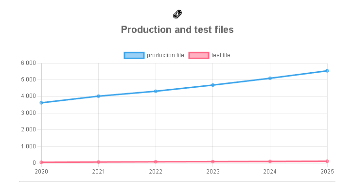

Repositório selecionado: <https://github.com/dbeaver/dbeaver>
Gráfico selecionado: <>
Explicação:

### Evolução ao longo do tempo

Nesse gráfico, é possível perceber que há um crescimento constante e até linear do número de arquivos de produção, de acordo com a linha azul.
Porém, o mesmo não acontece com a linha vermelha, que representa o número de arquivos de teste. Esta linha mostra um crescimento muito leve, quase irrisório, ao passar dos anos, e em uma proporção muito menor do que o crescimento do número de arquivos de produção.
Ou seja, se tratando da evolução ao longo do tempo, a quantidade de arquivos de produção e de teste cresceram, porém, há uma distância muito grande na quantidade e no coeficiente de crescimento entre as duas estatísticas.

### Curvas vs Boas práticas

É perceptível que a curva de crescimento de testes não acompanha a curva de crescimento de arquivos de produção. O que representa um problema no tocante às boas práticas. Isso porque, em um projeto saudável, é esperado que arquivos de teste cresçam de forma proporcional aos arquivos de produção, sendo de suma importância para o controle de qualidade do código.

### Grandes alterações nas curvas

De forma geral, não há grandes curvas nesse gráfico. Na realidade, é impressionante que em todos os gráficos em que se tem uma comparação de tempo, percebe-se que em todos os anos analisados o crescimento foi notadamente constante, não tendo grandes picos ou quedas nos índices.

### Explicações na documentação

Não consegui encontrar nenhuma informação na documentação que justifique a baixa cobertura de testes. A documentação do dbeaver é muito direcionada ao usuário, contendo instruções de uso e sem muitos detalhes técnicos.
Além disso, o crescimento linear nos índices analisados condiz com o fato do Dbeaver ser uma ferramenta em constante aprimoramento, mostrando que ao passar dos anos, mais arquivos são criados, o que mostra que novas funcionalidades estão entrando, mas, como disse anteriormente, sem picos ou quedas na quantidade de arquivos, apenas um crescimento uniforme.
